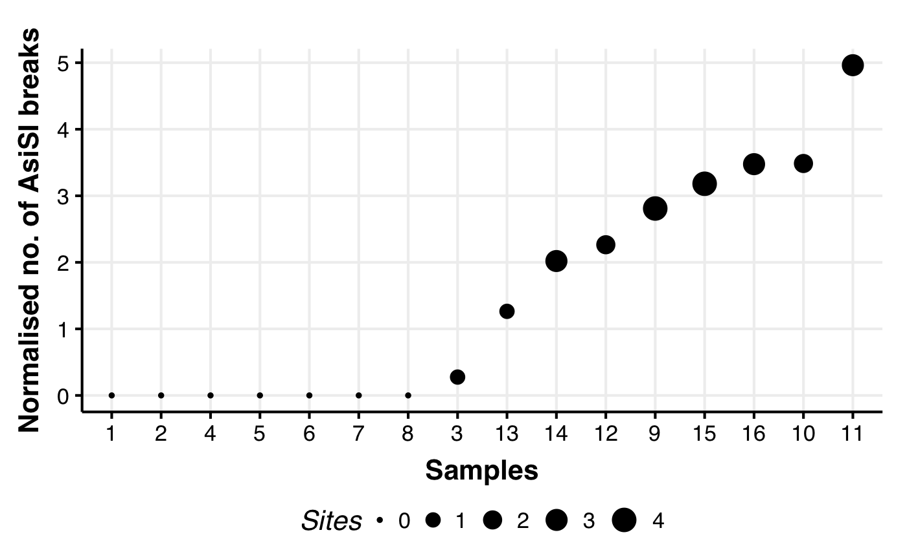

## Requirements
The challenge was completed in Python 3.11.4.

Requirements can be found in requirements.txt
- pandas version 1.5.3
- pyranges version 0.0.129

## Scripts

## Workflow
The workflow was created using Nextflow Version: 23.04.3 build 5875

## Results

The output file from the nextflow implementation contains the following columns: 
-   **Sample:** The sample names for each bed file
-   **Total filtered breaks:** The total number of breakpoints in the bedfile with a MAPQ>=30
-   **No. of AsiSI breaks:** The number of breaks in each sample which intersect with AsiSI breaks
-   **Normalised no. of AsiSI breaks:** The sum of AsiSI breaks in each sample divided by the total number of filtered breaks / 1000
-   **No. of unique AsiSI sites overlapped:** The absolute number of AsiSI sites found in a sample 

| Sample | Total filtered breaks | No. of AsiSI breaks | Normalised no. of AsiSI breaks | No. of unique AsiSI sites overlapped |
|:----|-------------:|------------:|------------------:|---------------------:|
| 1      |                  7559 |                   0 |                       0.000000 |                                    0 |
| 2      |                 10088 |                   0 |                       0.000000 |                                    0 |
| 3      |                  3628 |                   1 |                       0.275634 |                                    1 |
| 4      |                  6800 |                   0 |                       0.000000 |                                    0 |
| 5      |                  5546 |                   0 |                       0.000000 |                                    0 |
| 6      |                  6285 |                   0 |                       0.000000 |                                    0 |
| 7      |                  5686 |                   0 |                       0.000000 |                                    0 |
| 8      |                  4431 |                   0 |                       0.000000 |                                    0 |
| 9      |                  1780 |                   5 |                       2.808989 |                                    4 |
| 10     |                  2869 |                  10 |                       3.485535 |                                    2 |
| 11     |                  2015 |                  10 |                       4.962779 |                                    3 |
| 12     |                  2208 |                   5 |                       2.264493 |                                    2 |
| 13     |                  1583 |                   2 |                       1.263424 |                                    1 |
| 14     |                  3466 |                   7 |                       2.019619 |                                    3 |
| 15     |                  4716 |                  15 |                       3.180662 |                                    4 |
| 16     |                  5179 |                  18 |                       3.475574 |                                    3 |

## Visualising the data

Using a scatter plot to visualise the data, samples were ordered from
high to low based on their Normalised no. of AsiSI breaks

## Questions

**1. Which of the samples are likely to be controls or treated?**

-   It looks like samples 1, 2, 4, 5, 6, 7, 8 are control samples as 0
    AsiSI breaks were detected

-   The remaining samples 13, 14, 12, 9, 15, 16, 10, 11 are in the
    treated group

**2. Are there any you are uncertain of?**

-   I am uncertain of sample 3 which only had 1 intersection with an
    AsiSI break

**3. Can you explain the samples in the uncertain group?**

-   Could there be false positive detection of an AsiSI site ? In other
    samples even if only 1 AsiSI site intersected with the samples break
    there were generally

-   Double check the mapping quality of this site?

**4. Of all the possible AsiSI sites described in the
chr21_AsiSI_sites.t2t.bed file what is the maximum percentage observed
in a single sample?**

-   To answer this question I used another python script in the workflow
    to look at the overlap of sites in a samples bed file with the AsiSI
    sites using the overlap function in Pyranges package

-   This identified all the “Unique” sites in a Samples bed file which
    overlapped 1 of a possible 71 AsiSI sites

-   The maximum number of AsiSI sites detected in a sample was 4 (found
    in samples 15 and 9, see last column of results table)

-   This means the maximum percentage of possible AsiSI sites observed
    in a single sample is 5.63% ((4/71)\*100)
